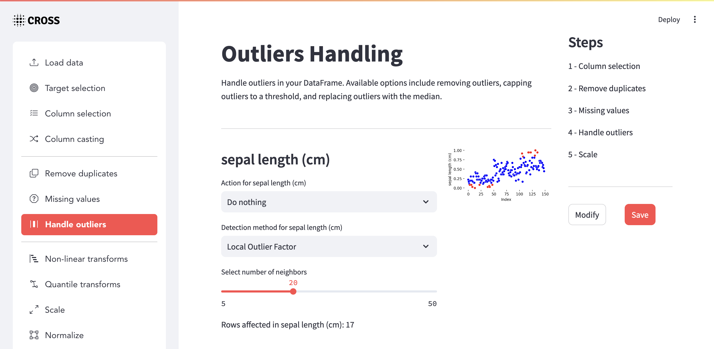

-----------------

# Cross: a versatile toolkit for data preprocessing and feature engineering in machine learning

Cross is a Python library for data processing to train machine learning models, featuring scaling, normalization, feature creation through binning, and various mathematical operations between columns. It includes a graphical interface for exploring and generating transformations, with the option to export and reuse them.




## Getting Started

To install the Cross library, run the following command:

```bash
pip install cross
```

You can initialize the graphical interface with the command:

```bash
cross run
```

Access the application by navigating to `http://localhost:8501` in your browser.


## Example of Use

### Define transformations

```python
transformations = [
    OutliersHandler(
        handling_options={
            "sepal length (cm)": ("remove", "iqr"),
            "sepal width (cm)": ("cap", "zscore"),
        },
        thresholds={
            "sepal length (cm)": 1.5,
            "sepal width (cm)": 2.5,
        },
    ),
    ScaleTransformation(
        transformation_options={
            "sepal length (cm)": "min_max",
            "sepal width (cm)": "min_max",
        }
    ),
    NumericalBinning(
        binning_options={
            "sepal length (cm)": "uniform",
        },
        num_bins={
            "sepal length (cm)": 5,
        },
    ),
    MathematicalOperations(
        operations_options=[
            ("sepal length (cm)", "sepal width (cm)", "add"),
        ]
    ),
]
cross = CrossTransformer(transformations)

# Fit & transform data
x_train, y_train = cross.fit_transform(x_train, y_train)
x_test, y_test = cross.transform(x_test, y_test)
```

### Export and Import Transformations

To save and reuse the transformations, export them to a file and load them in future sessions:

```python
# Export transformations to a file
cross.save_transformations("cross_transformations.pkl")

# Import transformations from the file
with open("cross_transformations.pkl", "rb") as f:
    transformations = pickle.load(f)

cross = CrossTransformer()
cross.load_transformations(transformations)
```

## Transformations

### Clean Data

#### **Column Selection**

Allows you to select specific columns for further processing.

- Parameters:
  - `columns`: List of column names to select.
  
```python
ColumnSelection(
    columns=[
        "sepal length (cm)",
        "sepal width (cm)",
    ]
)
```

#### **Column Casting**

Casts columns to specific data types.

- Parameters:
  - `cast_options`: A dictionary specifying the type for each column. Options include: `category`, `number`, `bool`, `datetime`, `timedelta`.
  
```python
CastColumns(
    cast_options={
        "sepal length (cm)": "number",
        "sepal width (cm)": "number",
    }
)
```

#### **Remove Duplicates**

Handles duplicate entries in the data.

- Parameters:
  - `subset`: List of columns to check for duplicates.
  - `keep`: Specifies which duplicate to keep (`none`, `first`, `last`, or `False` for no duplicates).
  
```python
RemoveDuplicatesHandler(
    subset=[
        "sepal length (cm)",
        "sepal width (cm)",
    ],
    keep="first"
)
```

#### **Missing Values**

Handles missing values in the dataset.

- Parameters:
  - `handling_options`: Dictionary that specifies the handling strategy for each column. Options: `drop`, `fill_0`, `most_frequent`, `fill_mean`, `fill_median`, `fill_mode`, `interpolate`, `fill_knn`.
  - `n_neighbors`: Number of neighbors for K-Nearest Neighbors imputation (used with `fill_knn`).
  
```python
MissingValuesHandler(
    handling_options={
        'sepal length (cm)': 'drop',
        'sepal width (cm)': 'fill_knn',
        'petal length (cm)': 'fill_mode',
        'petal width (cm)': 'interpolate',
        
    },
    n_neighbors= {
        'sepal width (cm)': 5,
    }
)
```

#### **Handle Outliers**

Manages outliers in the dataset using different strategies.

- Parameters:
  - `handling_options`: Dictionary specifying the handling strategy. Options: `none`, `remove`, `cap`, `median`, `lof`, `iforest`.
  - `thresholds`: Dictionary with thresholds for `iqr` and `zscore` methods.
  - `lof_params`: Dictionary specifying parameters for the LOF method.
  - `iforest_params`: Dictionary specifying parameters for Isolation Forest.
  
```python
OutliersHandler(
    handling_options={
        'sepal length (cm)': ('remove', 'iqr'),
        'sepal width (cm)': ('cap', 'zscore'),
        'petal length (cm)': ('median', 'lof'),
        'petal width (cm)': ('remove', 'iforest'),
    },
    thresholds={
        'sepal length (cm)': 1.5,
        'sepal width (cm)': 2.5,    
    },
    lof_params={
        'petal length (cm)': {
            'n_neighbors': 20,
        }
    },
    iforest_params={
        'petal width (cm)': {
            'contamination': 0.1,
        }
    }
)
```

### Preprocessing

#### **Quantile Transformations**

Applies quantile transformations for normalizing data.

- Parameters:
  - `transformation_options`: Dictionary specifying the transformation type. Options: `uniform`, `normal`.
  
```python
QuantileTransformation(
    transformation_options={
        'sepal length (cm)': 'uniform',
        'sepal width (cm)': 'normal',
    }
)
```

#### **Scale Transformations**

Scales numerical data using different scaling methods.

- Parameters:
  - `transformation_options`: Dictionary specifying the scaling method for each column. Options: `min_max`, `standard`, `robust`, `max_abs`.
  
```python
ScaleTransformation(
    transformation_options={
        'sepal length (cm)': 'min_max',
        'sepal width (cm)': 'standard',
        'petal length (cm)': 'robust',
        'petal width (cm)': 'max_abs',
    }
)
```

#### **Normalization**

Normalizes data using L1 or L2 norms.

- Parameters:
  - `transformation_options`: Dictionary specifying the normalization type. Options: `l1`, `l2`.
  
```python
Normalization(
    transformation_options={
        'sepal length (cm)': 'l1',
        'sepal width (cm)': 'l2',
    }
)
```

### Feature Engineering

#### **Categorical Encoding**

Encodes categorical variables using various methods.

- Parameters:
  - `encodings_options`: Dictionary specifying the encoding method for each column. Options: `label`, `ordinal`, `onehot`, `dummy`, `binary`, `count`, `target`.
  - `ordinal_orders`: Specifies the order for ordinal encoding.

```python
CategoricalEncoding(
    encodings_options={
        'Sex': 'label',
        'Size': 'ordinal',
    },
    ordinal_orders={
        "Size": ["small", "medium", "large"]
    }
)
```

#### **Date Time Transforms**

Transforms datetime columns into useful features.

- Parameters:
  - `datetime_columns`: List of columns to extract date/time features from.
  
```python
DateTimeTransformer(
    datetime_columns=["date"]
)
```

#### **Cyclical Features Transforms**

Transforms cyclical features like time into a continuous representation.

- Parameters:
  - `columns_periods`: Dictionary specifying the period for each cyclical column.
  
```python
CyclicalFeaturesTransformer(
    columns_periods={
        "date_minute": 60,
        "date_hour": 24,
    }
)
```

#### **Numerical Binning**

Bins numerical columns into categories.

- Parameters:
  - `binning_options`: Dictionary specifying the binning method for each column. Options: `uniform`, `quantile`, `kmeans`.
  - `num_bins`: Number of bins for each column.
  
```python
NumericalBinning(
    binning_options={
        "sepal length (cm)": "uniform",
        "sepal width (cm)": "quantile",
        "petal length (cm)": "kmeans",
    },
    num_bins={
        "sepal length (cm)": 5,
        "sepal width (cm)": 6,
        "petal length (cm)": 7,
    }
)
```

#### **Mathematical Operations**

Performs mathematical operations between columns.

- Parameters:
  - `operations_options`: List of tuples specifying the columns and the operation.

- **Options**:
  - `add`: Adds the values of two columns.
  - `subtract`: Subtracts the values of two columns.
  - `multiply`: Multiplies the values of two columns.
  - `divide`: Divides the values of two columns.
  - `modulus`: Computes the modulus of two columns.
  - `power`: Raises the values of the first column to the power of the second.
  - `hypotenuse`: Computes the hypotenuse of two columns.
  - `mean`: Calculates the mean of two columns.
  
```python
MathematicalOperations(
    operations_options=[
        ('sepal length (cm)', 'sepal width (cm)', 'add'),
        ('petal length (cm)', 'petal width (cm)', 'subtract'),
        ('sepal length (cm)', 'petal length (cm)', 'multiply'),
        ('sepal width (cm)', 'petal width (cm)', 'divide'),
        ('sepal length (cm)', 'petal width (cm)', 'modulus'),
        ('sepal width (cm)', 'petal length (cm)', 'power'),
        ('sepal length (cm)', 'sepal width (cm)', 'hypotenuse'),
        ('petal length (cm)', 'petal width (cm)', 'mean'),
    ]
)
```
